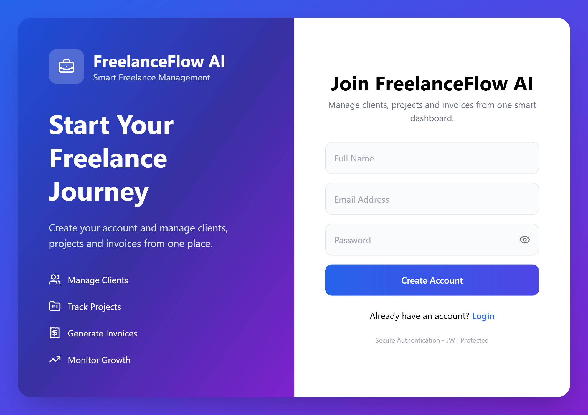
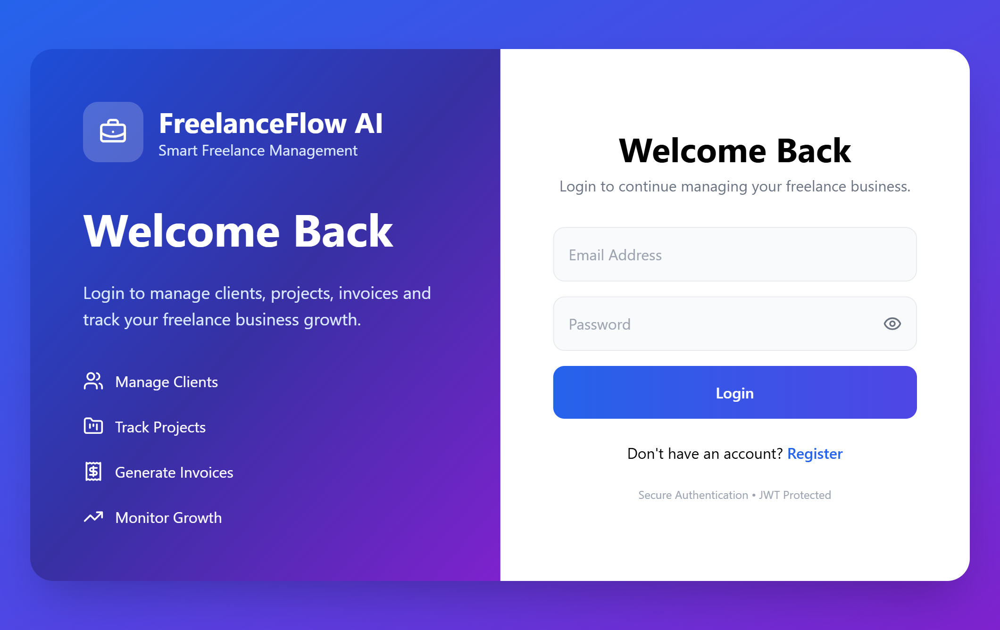
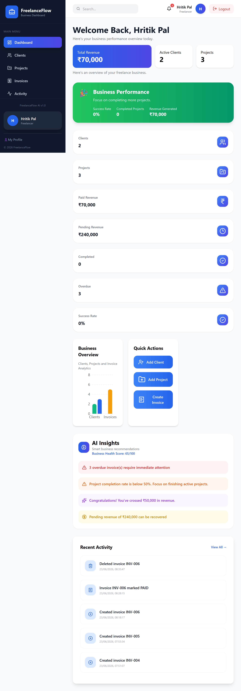
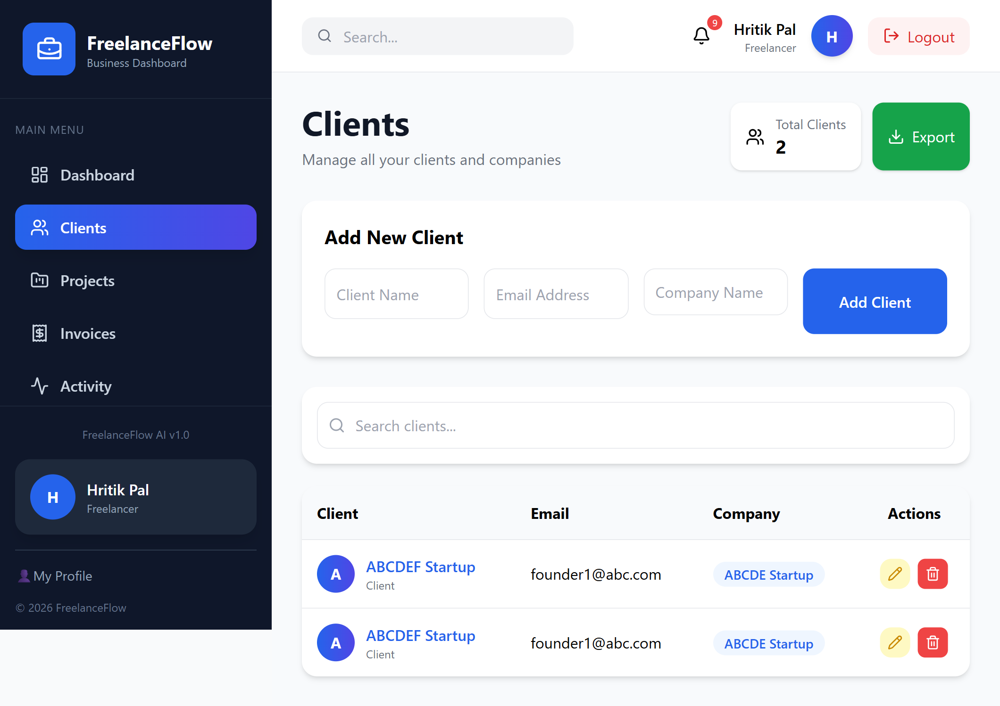
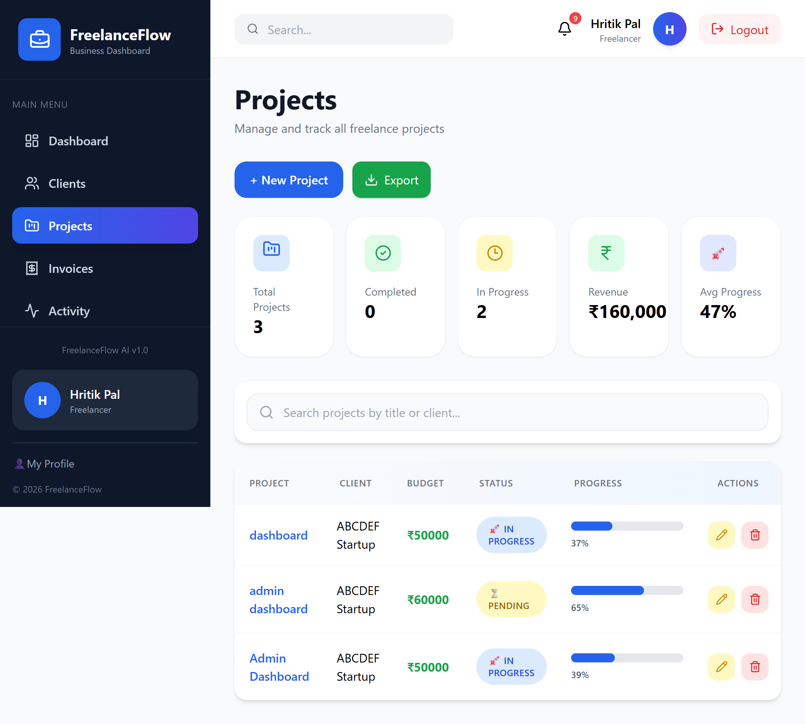
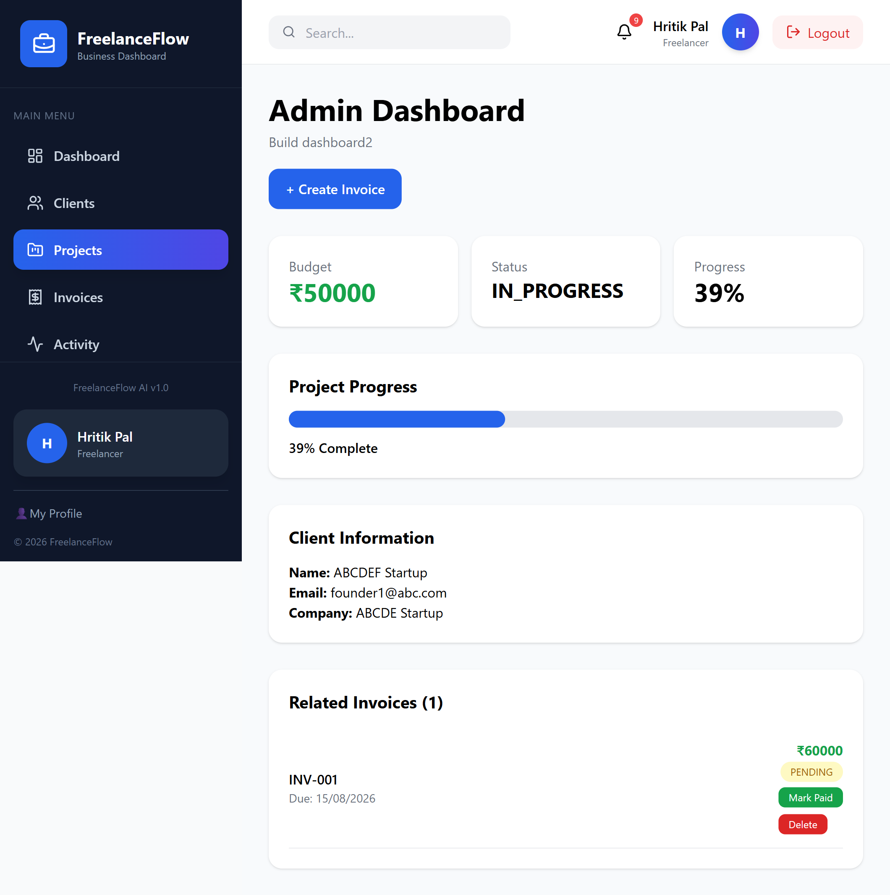
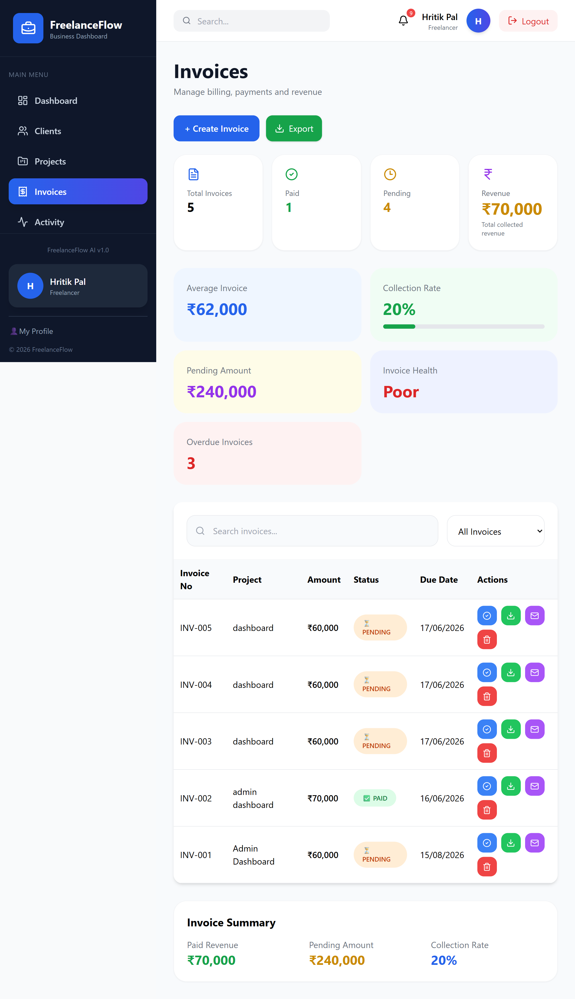
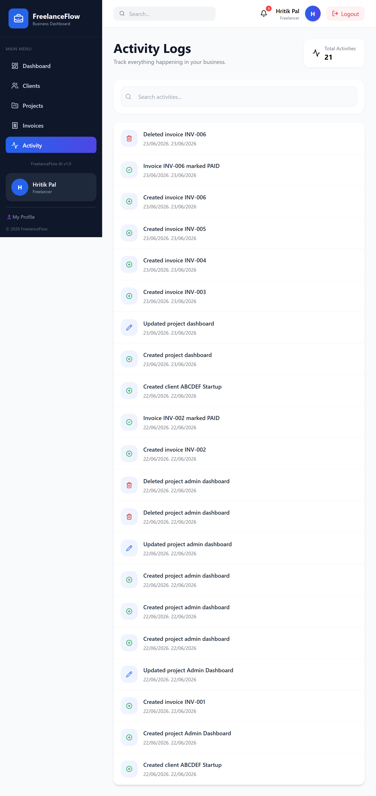
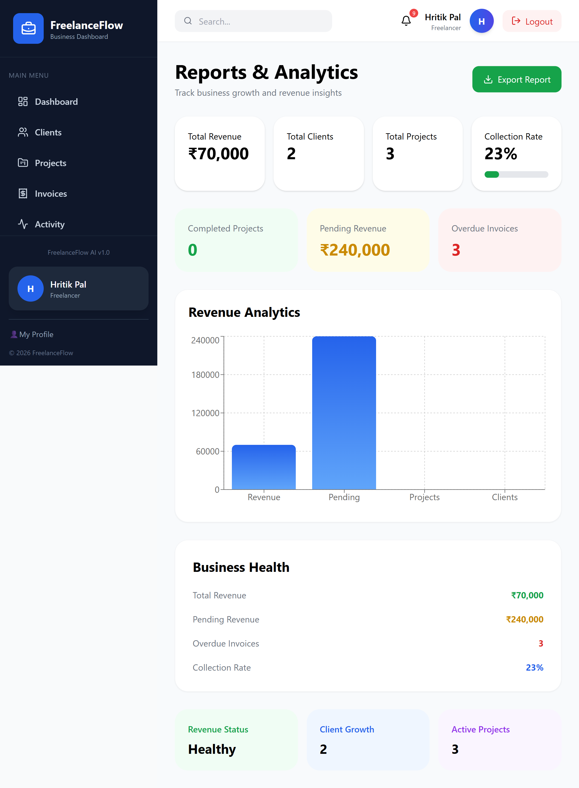
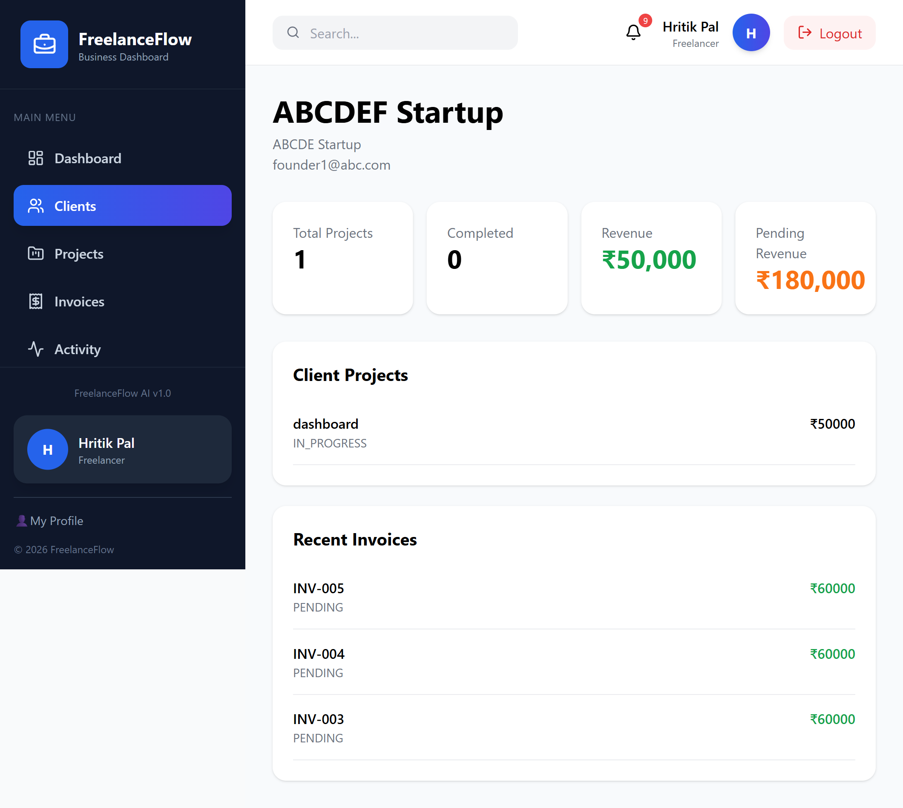

# FreelanceFlow AI

A full-stack freelance management SaaS platform built with React, Node.js, Express, PostgreSQL, and Prisma. FreelanceFlow AI helps freelancers and agencies manage clients, projects, invoices, payments, activity logs, and business analytics from a single dashboard.

---

## Live Demo

### Frontend

https://your-frontend-url.vercel.app

### Backend API

https://your-backend-url.onrender.com

---

## Features

### Authentication & Security

* JWT Authentication
* User Registration & Login
* Protected Routes
* Secure API Access
* Role-Based Authorization Ready

### Dashboard Analytics

* Total Clients Overview
* Total Projects Overview
* Revenue Tracking
* Invoice Statistics
* Collection Rate Analytics
* Overdue Invoice Monitoring
* Activity Tracking

### Client Management

* Create Clients
* Update Client Details
* Delete Clients
* Search Clients
* Client Detail Page
* Client Revenue Tracking
* Client Project Tracking

### Project Management

* Create Projects
* Update Projects
* Delete Projects
* Project Progress Tracking
* Project Detail Page
* Client Association
* Status Management
* Budget Tracking

### Invoice Management

* Create Invoices
* Edit Invoice Status
* Mark Invoice as Paid
* Delete Invoices
* Invoice Search & Filters
* Overdue Invoice Tracking
* Collection Rate Monitoring
* Create Invoice Directly from Project Page

### PDF Generation

* Download Professional Invoice PDFs
* Export Invoice Records
* Printable Documents

### Email Integration

* Send Invoice Emails
* Client Communication Support
* Automated Email Workflow Ready

### Activity Logs

* Client Activity Tracking
* Project Activity Tracking
* Invoice Activity Tracking
* User Action History

### Data Export

* Export Projects to Excel
* Export Invoices to Excel
* Business Reporting

### Responsive Design

* Desktop Optimized
* Tablet Responsive
* Mobile Friendly
* Modern SaaS UI

---

## Screenshots

### Register



### Login



### Dashboard



### Clients



### Projects



### Project Details



### Invoices



### Activity



### Reports



### Client Details



---

## Tech Stack

### Frontend

* React.js
* Vite
* Tailwind CSS
* React Router DOM
* Axios
* Recharts
* React Hot Toast
* Lucide React

### Backend

* Node.js
* Express.js
* JWT Authentication
* Nodemailer
* PDFKit

### Database

* PostgreSQL
* Prisma ORM
* Neon Database

### Deployment

* Vercel (Frontend)
* Render (Backend)
* Neon PostgreSQL (Database)

---

## Database Schema

### User

* Authentication
* Client Ownership
* Activity Tracking

### Client

* Name
* Email
* Company
* Associated Projects

### Project

* Title
* Description
* Budget
* Progress
* Status
* Deadline
* Client Association

### Invoice

* Invoice Number
* Amount
* Status
* Due Date
* Notes
* Project Association

### Activity Logs

* Action Type
* Entity Type
* Entity ID
* Timestamp

---

## Installation

### Clone Repository

```bash
git clone https://github.com/HRITIK200/FreelanceFlow-AI.git
cd freelanceflow-ai
```

### Backend Setup

```bash
cd server
npm install

```

Run migrations:

```bash
npx prisma migrate dev
npx prisma generate
```

Start backend:

```bash
npm run dev
```

### Frontend Setup

```bash
cd client
npm install
```

Create `.env`:

```env
VITE_API_URL=http://localhost:5000/api
```

Start frontend:

```bash
npm run dev
```

---

## Project Architecture

Frontend (React + Tailwind)
↓
Axios API Layer
↓
Express Backend
↓
Prisma ORM
↓
PostgreSQL Database

Additional Services:

* JWT Authentication
* PDF Generation
* Email Service
* Excel Export

---

## Key Learning Outcomes

* Full Stack MERN Development
* REST API Design
* Authentication & Authorization
* Database Design with Prisma
* PostgreSQL Integration
* SaaS Application Architecture
* Invoice Management Systems
* PDF Generation
* Email Automation
* Responsive UI Development
* Deployment & Production Setup

---

## Future Improvements

* Role-Based Access Control
* Payment Gateway Integration
* Recurring Invoices
* Team Collaboration
* Notification System
* Dark Mode
* Advanced Analytics
* AI-Powered Insights

---

## Author

### Hritik Pal

MCA Graduate (2025)

Full Stack MERN Developer

GitHub: https://github.com/HRITIK200

LinkedIn: https://www.linkedin.com/in/hritik-pal-616005217/

Email: [palhritik18@gmail.com]
